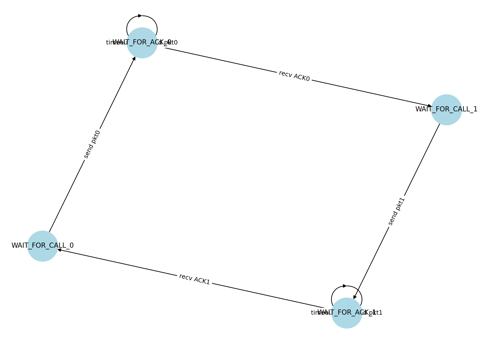
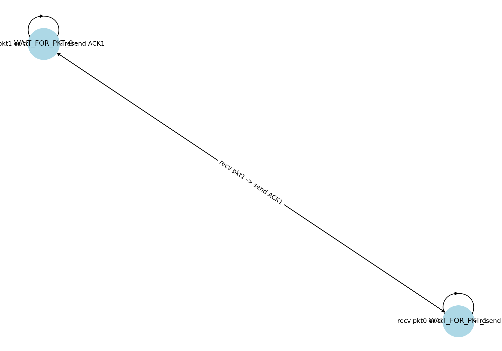

# Reliable Data Transfer Protocol Implementation  
## (rdt 3.0, Go-Back-N, Selective Repeat)

### Submitted by:
- Name: Shahzain Zaidi  
- Student ID: 22k-4112  

---

## 1. Objective
This project implements:
- rdt 3.0 (Stop-and-Wait Protocol)
- Go-Back-N Protocol (GBN)
- Selective Repeat Protocol (SR)

Simulating:
- Packet Loss  
- Packet Corruption  
- Packet Delay  

Using:
- Finite State Machines (FSM) for Sender & Receiver  
- Python  

---

## 2. Technologies Used
| Tool | Purpose |
|------|---------|
| Python | Main Programming Language |
| NetworkX & Matplotlib | FSM Diagrams |
| Random & Time | Simulating Network Issues |

---

## 3. Folder Structure
```
│── main.py                # To run & test protocols
│── config.py              # Easy configuration file
│── rdt3.py                # rdt 3.0 Protocol
│── gbn.py                 # Go-Back-N Protocol
│── sr.py                  # Selective Repeat Protocol
│── network_simulator.py   # Simulates Loss, Corruption, Delay
│── sender_rdt3_fsm.png    # Sender FSM Diagram (rdt3)
│── receiver_rdt3_fsm.png  # Receiver FSM Diagram (rdt3)
```

---

## 4. Protocol Explanation

### rdt 3.0 (Stop and Wait)
- Send 1 packet -> Wait for ACK.
- Resend on Timeout.
- Receiver sends ACK for correct packet only.

---

### Go-Back-N (GBN)
- Window-based sending.
- If ACK lost or timeout occurs → resend all packets from the lost one.

---

### Selective Repeat (SR)
- Window-based sending.
- If packet lost → resend only that lost packet.
- Receiver buffers out-of-order packets.

---

## 5. FSM Diagrams

### Sender FSM (rdt 3.0)


### Receiver FSM (rdt 3.0)


---

## 6. Testing Scenarios & Results

| Scenario | Observation | Result |
|----------|-------------|--------|
|Ideal (No Loss) | All packets delivered correctly | Pass |
|Packet Loss | Sender resends lost packets | Pass |
|Packet Corruption | Receiver discards corrupted, sender resends | Pass |
|Packet Delay | Receiver accepts after delay, sender waits | Pass |


---

## 7. Execution Guide

### 1. Configure Network Settings
In `config.py`
```python
TOTAL_PACKETS = 5
LOSS_PROBABILITY = 0.2
CORRUPT_PROBABILITY = 0.1
DELAY_PROBABILITY = 0.1
```

---

### 2. Run Code
```bash
python main.py
```

Choose:
- 1 = rdt 3.0
- 2 = Go-Back-N
- 3 = Selective Repeat
